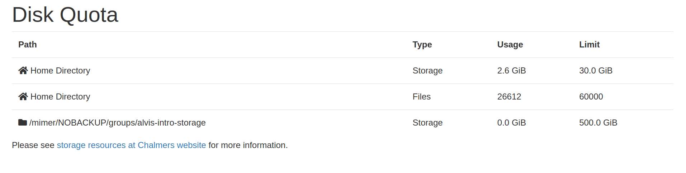

# Alvis OnDemand DiskQuota

Passenger plugin for displaying live disk quota at [Alvis OnDemand](https://portal.c3se.chalmers.se).


## Prerequisites

This app is developed for Alvis OnDemand and relies on (albeit few) local data
containing information about quota and usage. The app requires `getfattr` (from the
`attr`-package in EL8) to read statistics from CephFS.

## Install
The app itself is self-contained and needs to be placed at
`/var/www/ood/apps/sys/ood_diskquota`.

```
$ cd /var/www/ood/apps/sys/
$ git clone https://github.com/c3se/ood_diskquota.git
```

## Customizations
You can customize the app by changing the ERB-files inside `views`.

## Debugging
Per user logs is found at `<ood_logs>/ondemand-nginx/<user>`.
